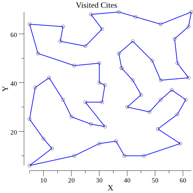
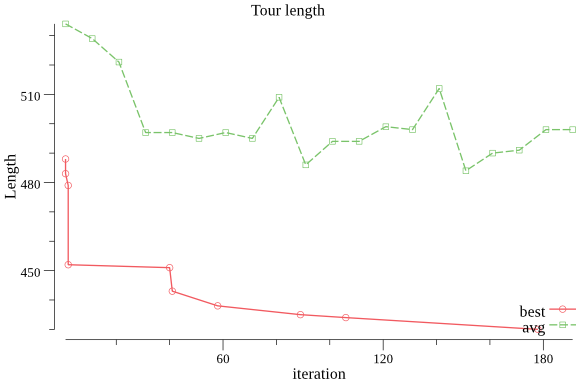

# aco-go
Ant Colony Optimization implement by golang





```

VERSION:
   1.3.1

AUTHOR:
   Liu Shengjian <lsj178@139.com>

COMMANDS:
     help, h  Shows a list of commands or help for one command

GLOBAL OPTIONS:
   --ants value, -a value        ant poplation. (default: 20)
   --iterations value, -i value  iterations. (default: 200)
   --tries value, -t value       try times. (default: 1)
   --speed, -s                   use multi CPU cores.
   --help, -h                    show help
   --version, -v                 print the version

```
